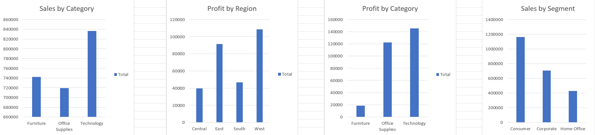

# Sales & Profit Analysis (Excel Project)

## Overview
This project analyzes sales and profit performance using Excel. The objective was to identify key trends, top-performing categories, and regional performance.

## Project Objective
The objective of this project was to analyze retail sales data and identify key patterns in revenue, profit, and customer segments. The analysis focuses on deriving actionable insights that can support business decision-making.

## Tools Used
- Microsoft Excel
- Pivot Tables
- Charts & Dashboarding

## Key Insights
- Technology category generated the highest overall sales and profit, indicating strong product demand
- West region outperformed other regions in profitability, suggesting better market conditions or pricing strategy
- Consumer segment contributed the largest share of total sales, making it the primary revenue driver
- Noticeable variation in profit margins across categories highlights cost and pricing inefficiencies
- Identified high-performing product categories
- Observed profit variation across segments
- Analyzed sales trends to support decision-making
  
## Dashboard Preview

## Files Included
- Excel Dashboard (.xlsx)
- Dashboard Image Preview

## Learnings
- Improved data cleaning and structuring
- Built interactive dashboards using pivot tables
- Learned how to extract meaningful business insights
